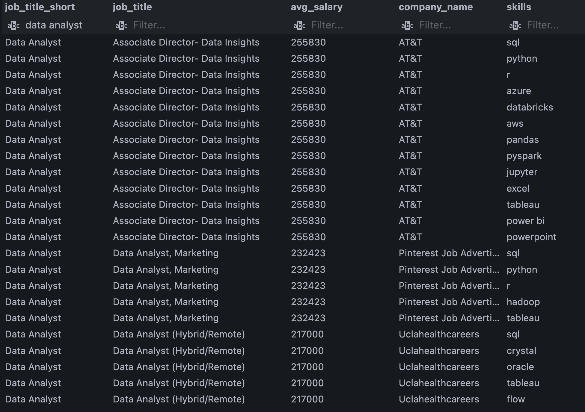
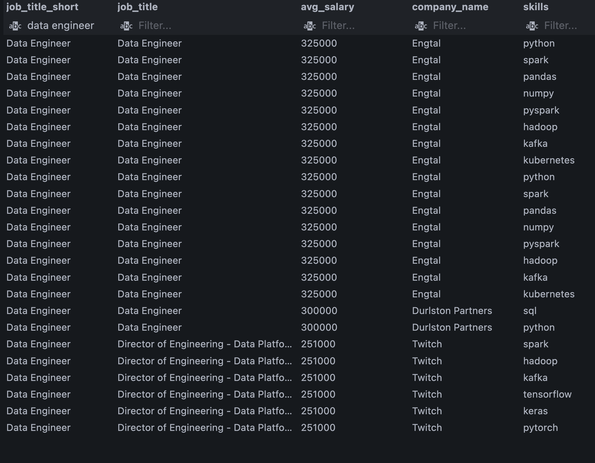
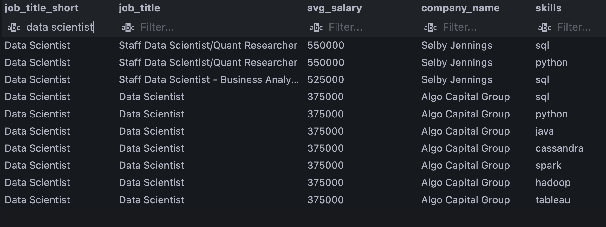
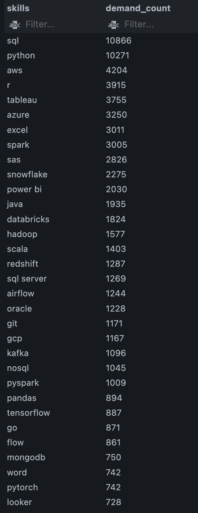
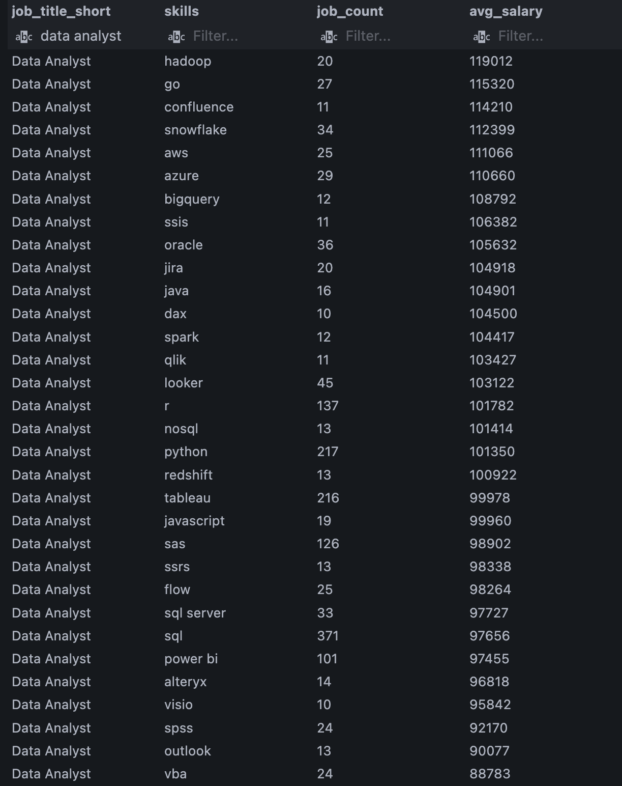
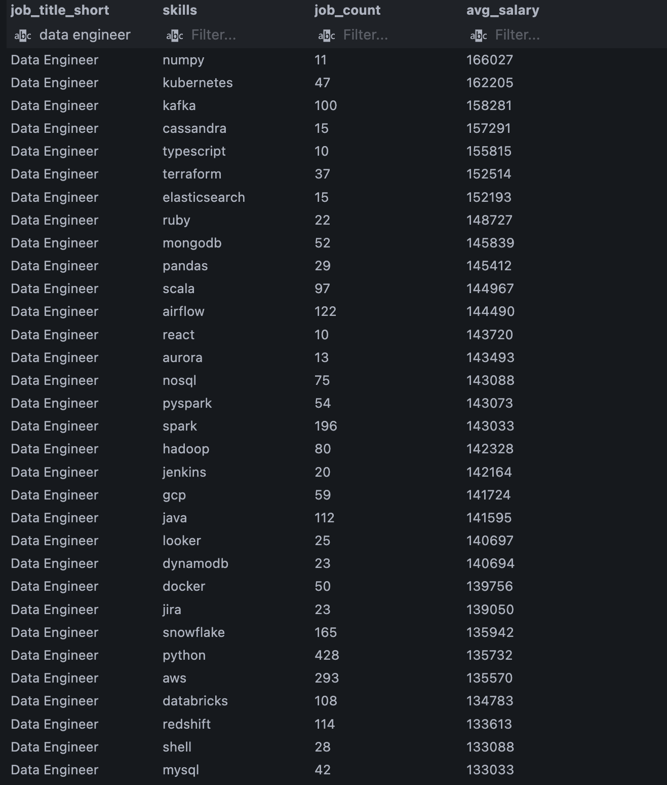
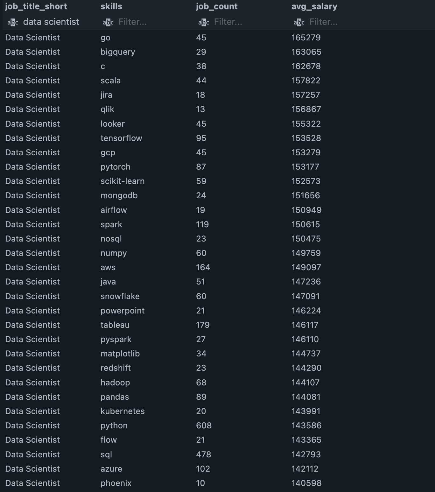
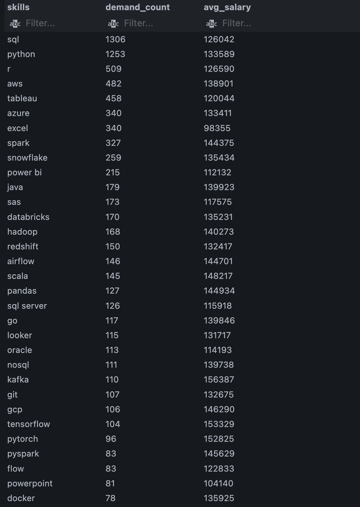

# Introduction
This project focuses on the data job market. I will be looking into top-paying jobs, in-demand skills, and where high demand meets high salary in positions such as Data Analyst, Data Scientist, and Data Engineers.

SQL queries? Check them out here: [sql_project folder](/sql_project/)

# Questions
The questions I wanted to answer in this project are as follows: 
1. What are the top-paying Data Analyst, Data Scientist, and Data Engineering jobs?
2. What skills are required for these top-paying jobs?
3. What skills are most in-demand for the three data roles?
4. Which skills are associated with higher salaries?
5. What are the most optimal skills to learn?

# Tools I used
For my deep dive into this data analysis on the data job market, I used several tools:

- **SQL:** I used SQL to query the database and help me establish critical insights.
- **PostgreSQL:** I chose postgres as my database management system for its modern capabilities for handling the job posting data.
- **Visual Studio Code:** I used VSCode as my go-to to execute SQL queries.
- **Git & GitHub:** Essential for version control and sharing my SQL scripts and analysis.

# The Analysis
Each query in this project was used for investigating specific aspects of the data job market.

### 1. Top-Paying Jobs
To identify the top paying Data Analyst, Data Scientist, Data Engineering roles, I filtered these roles by average yearly salary and location. I focused on remote jobs in the United States. This query shows the high paying opportunites in the field.

```sql
WITH
    top_paying_jobs AS (
        SELECT
            j.job_id,
            j.job_title,
            j.job_title_short,
            c.name AS company_name,
            j.job_location,
            j.salary_year_avg,
            j.job_schedule_type,
            j.job_posted_date,
            ROW_NUMBER() OVER (
                PARTITION BY
                    j.job_title_short
                ORDER BY
                    j.salary_year_avg DESC
            ) AS salary_rank
        FROM
            job_postings_fact AS j
            INNER JOIN company_dim AS c ON j.company_id = c.company_id
        WHERE
            j.job_title_short IN ('Data Analyst', 'Data Scientist', 'Data Engineer')
            AND j.job_country = 'United States'
            AND j.job_location = 'Anywhere'
            AND j.salary_year_avg IS NOT NULL
    )
SELECT
    job_id,
    job_title_short,
    job_title,
    company_name,
    job_location,
    salary_year_avg,
    job_schedule_type,
    job_posted_date,
    salary_rank
FROM
    top_paying_jobs
WHERE
    salary_rank <= 10
ORDER BY
    job_title_short DESC,
    salary_year_avg DESC;
```

**Results:**
- **Salary Range:** Data Analysts roles range from $170k - $337k. Data Engineering roles range from $242k - $325k. Data Scientist roles range from $280k - $550k. 
- **Data Roles:** Data Scientists and Data Engineering roles have higher end salaries as compared to Data Analysts. Data Scientists being the highest paid job title for these remote roles in the United States.


### 2. Skills Required
The goal here was to determine which skills were required for the high salaried roles for Data Analysts, Data Scientists, and Data Engineers. I used a ranking system to show me the highest paid roles, then I joined two different tables (skills_dim, skills_job_dim) to my fact table (job_postings_fact). By joining, this allowed me to see which skills were required for the high salary roles.

```sql
WITH
    skills_required AS (
        SELECT
            j.job_id,
            j.job_title_short,
            j.job_title,
            j.salary_year_avg,
            c.name AS company_name,
            ROW_NUMBER() OVER (
                PARTITION BY
                    j.job_title_short
                ORDER BY
                    j.salary_year_avg DESC
            ) AS salary_rank
        FROM
            job_postings_fact AS j
            INNER JOIN company_dim AS c ON j.company_id = c.company_id
        WHERE
            j.job_title_short IN ('Data Analyst', 'Data Scientist', 'Data Engineer')
            AND j.job_country = 'United States'
            AND j.job_location = 'Anywhere'
            AND j.salary_year_avg IS NOT NULL
    )
SELECT
    sr.job_title_short,
    sr.job_title,
    ROUND(sr.salary_year_avg) AS avg_salary,
    sr.company_name,
    sd.skills
FROM
    skills_required AS sr
    INNER JOIN skills_job_dim AS sjd ON sr.job_id = sjd.job_id
    INNER JOIN skills_dim AS sd ON sjd.skill_id = sd.skill_id
WHERE
    sr.salary_rank < 5
ORDER BY
    sr.job_title_short,
    avg_salary DESC;
```

**Results:** 
-  **Data Analyst:** skills associated with high paying Data Analyst roles were: SQL, Python, Azure, Databricks, AWS, Tableau, Power BI. 
- **Data Engineer:** skills associated with high paying Data Engineering roles were: Python, Spark, Pandas, Numpy, kafka, kubernetes, SQL.
- **Data Scientist:** skills associated with high paying Data Scientist roles were: SQL, Spark, Tableau, Python, Java, Hadoop. 
- **Put Together:** The data shows that all 3 roles share skills such as SQL and Python, while cloud platforms and database technologies were also required.

**Data Analyst Results:**


**Data Engineer Results:**


**Data Scientist Results:**



### 3. Most in-demand skills
I wanted to see how many times each skill appeared in job postings, this would help me determine which skills are in-demand for Data Analyst, Data Engineering, and Data Scientist positions. I used an aggregation of count to get the total times each skill appeared for each job posting. I used more joins to connect the skills table to my main table. Then i grouped by skills from the skills table, then I ordered the result by count. Remember, these are for remote roles in the united states.

```sql
SELECT
    sd.skills,
    COUNT(sjd.job_id) AS demand_count
FROM
    job_postings_fact AS j
    INNER JOIN skills_job_dim AS sjd ON j.job_id = sjd.job_id
    INNER JOIN skills_dim AS sd ON sjd.skill_id = sd.skill_id
WHERE
    j.job_title_short IN ('Data Analyst', 'Data Engineer', 'Data Scientist')
    AND j.job_country = 'United States'
    AND j.job_location = 'Anywhere'
GROUP BY
    sd.skills
ORDER BY
    demand_count DESC;
```

**Results:** 
- **Skills:** The skill with the highest count in the results was SQL appearing in 10,866 job postings. A close second was Python appearing in 10,271 job postings.
- **Cloud:** from the results, there were 3 notable cloud platforms such as AWS, Azure, and Snowflake which appeared in the top ten rows. This result was not surprising as the three roles I am comparing has data as its main component.
- **Visual:** Other notable skills which appeared in many different job postings were visualization tools such as Tableau and PowerBI.




### 4. Top Paying Skills
In this section, I wanted to ask a different question, which skills are the highest paid. I looked at average salaries across these skills for the three data roles I have been comparing this entire project (Data Analyst, Data Engineers, Data Scientists). This will be able to help someone determine which skills to learn and figure at which of those skills are most rewarding. In this query, I used a count to get a number of each job positions and i paired it with a having clause just to keep the result shorter, then I decied to round the salary to amke it look cleaner, then i joined the necessary tables of skills and job postings table. I filtered for remote jobs in the united states and then i ordered the data by salary in descending order.

```sql
SELECT
    j.job_title_short,
    sd.skills,
    COUNT(*) AS job_count,
    ROUND(AVG(salary_year_avg)) AS avg_salary
FROM
    job_postings_fact AS j
    INNER JOIN skills_job_dim AS sjd ON j.job_id = sjd.job_id
    INNER JOIN skills_dim as sd ON sjd.skill_id = sd.skill_id
WHERE
    j.job_title_short IN ('Data Analyst', 'Data Scientist', 'Data Engineer')
    AND j.job_country = 'United States'
    AND j.job_location = 'Anywhere'
    AND j.salary_year_avg IS NOT NULL
GROUP BY
    j.job_title_short,
    sd.skills
HAVING
    COUNT(*) >= 10
ORDER BY
    j.job_title_short,
    avg_salary DESC;
```

**Results:**
- **first look:** There was a lot to unpack from the results. such as the highest paid skill for a Data analyst was hadoop at an average salary of $119,012. however, hadoop only appeared in 20 jobs. for example, SQL appeared in 371 Data analyst jobs and averaged a salary of $97,656. 
For data engineers, the highest paid skill was numpy appearing in only 11 job postings with an average salary of $166,027. SQL appeared in a higher number of job postings than data analyst roles. for data engineers, SQL appeared in 457 postings with an average salary of $131,566. 
For data scientists, the highest paid skill was go and bigquery, go appeared in 45 jobs postings while bigquery appeared in only 29 postings. Python was the skill that appeared in most data science roles at 608 with an average salary of $143,586.

**Data Analyst Results:**
 

**Data Engineer Results:**


**Data Scientist Results:**



### 5. What are the most optimal skills to learn
For this task, I wanted to combine my thought process from section 3 and 4. So, I put together the most in-demand skills with the highest average salary skills. This would help me determine which skills were the most optimal to learn. The goal was to show which skills offer job opportunities and financial benefits. I did this by using the aggregation count to get the count of each skill and then i paired it with with the average salary. sorting this data will show me which skills were the most optimal for the three chosen data roles of Data analyst, Data engineers, and Data scientists.

```sql
SELECT
    sd.skills,
    COUNT(DISTINCT j.job_id) AS demand_count,
    ROUND(AVG(j.salary_year_avg)) AS avg_salary
FROM
    job_postings_fact AS j
    INNER JOIN skills_job_dim AS sjd ON j.job_id = sjd.job_id
    INNER JOIN skills_dim AS sd ON sjd.skill_id = sd.skill_id
WHERE
    j.job_title_short IN ('Data Analyst', 'Data Engineer', 'Data Scientist')
    AND j.job_country = 'United States'
    AND j.job_location = 'Anywhere'
    AND j.salary_year_avg IS NOT NULL
GROUP BY
    sd.skills
HAVING
    COUNT(DISTINCT j.job_id) >= 10
ORDER BY
    demand_count DESC,
    avg_salary DESC;
```

**Results:**
- **Optimal Skills:** After retrieving the results I learned that the ten most optimal skills were SQL, Python, R, AWS, Tableau, Azure, Excel, Spark, Snowflake, and Power BI. these skills have a high demand count which means they are required for the 3 data roles. they appeared in many job postings.
- **Salary based:** The results also showed the skills with average salaries above $100k. This is a good average to show financial security. 
- **Final:** The results showed that these skills and tools are optimal and recommended to learn. This will help in career development but also helps guide college students look to enter the data world.



# What I learned
- This project helped strengthened my ability to use JOINs as the dataset was composed of 4 tables (job_postings_fact, company_dim, skills_dim, skills_job_dim)
- I learned how to use CTEs and Window functions to help me break down the dataset and compare 3 different roles instead of using just one.
- I improved my knowledge of aggregation methods such as COUNT(), AVG(), HAVING.
- Learned how to turn business questions into SQL queries and used the data to help drive my conclusions
- I learned how to compare skill demand with salary based skills to help identify skills that provide strong job security and financial opportunity

# Conclusion
This analysis provided insights into the relationship between skills and remote job opportunities in the United States for roles such as Data Analyst, Data Engineers, and Data Scientists. I achieved this by analyzing job postings, salaries, and required skills. I was able to identify the high-paying roles and then build upon that question and learned which skills were related to these high-salaried positions. It led me to finding the most in-demand skills and the skills with the highest average salary. I was able to finish my analysis by combining these results into finding the most optimal skills.