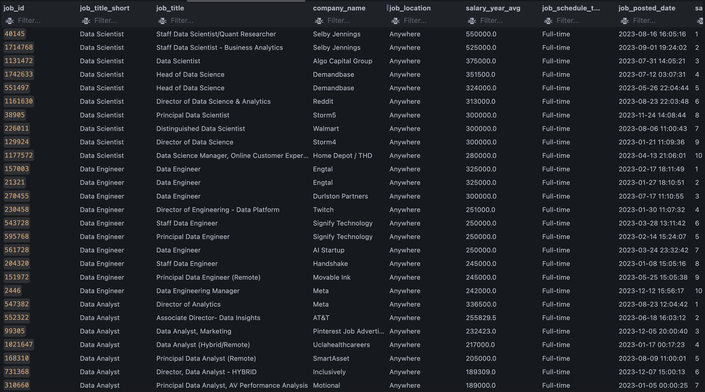

# Introduction
This project focuses on the data job market. I will be looking into top-paying jobs, in-demand skills, and where high demand meets high salary in positions such as Data Analyst, Data Scientist, and Data Engineers.

SQL queries? Check them out here: [sql_project folder](/sql_project/)

# Questions
The questions I wanted to answer in this project are as follows: 
1. What are the top-paying Data Analyst, Data Scientist, and Data Engineering jobs?
2. What skills are required for these top-paying jobs?
3. What skills are most in-demand for the three data roles?
4. Which skills are associated with higher salaries?
5. What are the most optimal skills to learn?

# Tools I used
For my deep dive into this data analysis on the data job market, I used several tools:

- **SQL:** I used SQL to query the database and help me establish critical insights.
- **PostgreSQL:** I chose postgres as my database management system for its modern capabilities for handling the job posting data.
- **Visual Studio Code:** I used VSCode as my go-to to execute SQL queries.
- **Git & GitHub:** Essential for version control and sharing my SQL scripts and analysis.

# The Analysis
Each query in this project was used for investigating specific aspects of the data job market.

### 1. Top-Paying Jobs
To identify the top paying Data Analyst, Data Scientist, Data Engineering roles, I filtered these roles by average yearly salary and location. I focused on remote jobs in the United States. This query shows the high paying opportunites in the field.

```sql
WITH
    top_paying_jobs AS (
        SELECT
            j.job_id,
            j.job_title,
            j.job_title_short,
            c.name AS company_name,
            j.job_location,
            j.salary_year_avg,
            j.job_schedule_type,
            j.job_posted_date,
            ROW_NUMBER() OVER (
                PARTITION BY
                    j.job_title_short
                ORDER BY
                    j.salary_year_avg DESC
            ) AS salary_rank
        FROM
            job_postings_fact AS j
            INNER JOIN company_dim AS c ON j.company_id = c.company_id
        WHERE
            j.job_title_short IN ('Data Analyst', 'Data Scientist', 'Data Engineer')
            AND j.job_country = 'United States'
            AND j.job_location = 'Anywhere'
            AND j.salary_year_avg IS NOT NULL
    )
SELECT
    job_id,
    job_title_short,
    job_title,
    company_name,
    job_location,
    salary_year_avg,
    job_schedule_type,
    job_posted_date,
    salary_rank
FROM
    top_paying_jobs
WHERE
    salary_rank <= 10
ORDER BY
    job_title_short DESC,
    salary_year_avg DESC;
```

Results:
- **Salary Range:** Data Analysts roles range from $170k - $337k. Data Engineering roles range from $242k - $325k. Data Scientist roles range from $280k - $550k. 
- **Data Roles:** Data Scientists and Data Engineering roles have higher end salaries as compared to Data Analysts. Data Scientists being the highest paid job title for these remote roles in the United States.



# What I learned

# Conclusions